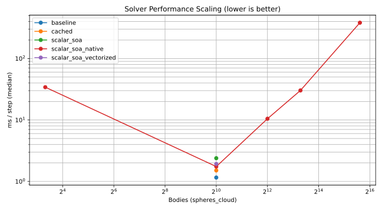
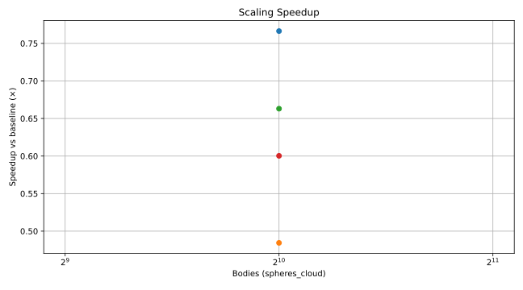

# ADMC Physics Bench
**Directional scalar contact solvers for games & simulation — benchmarked.**

This repository is a compact, self-contained lab for testing how far you can push **one-direction (scalar) contact rows**—motivated by **ADMC (Additive Directional Momentum Conservation)**—versus classic vector-per-row solvers. It targets rigid-body contacts (and joints), clean benchmarking, and reproducibility.

> 🔎 Background: See [docs/admc_overview.md](docs/admc_overview.md) for the theory and proof, and [docs/nr_math.md](docs/nr_math.md) for the Newtonian math this repo implements.

---

## 📈 Performance (auto-updated by CI)

The charts below are regenerated on each push to `main` by the `bench-and-plot` workflow.
They show **ms/step** vs **scene size** (log–log) and **speedup vs baseline** for the scalar-cached and SoA-family solvers (including the native SIMD variant).

<p align="center">
  
</p>

<p align="center">
  
</p>

_Charts generated by the `bench-and-plot` CI workflow on GitHub Actions (`ubuntu-latest`, Ninja + default GCC toolchain) using `cmake -S . -B build -G Ninja -DADMC_BUILD_BENCH=ON -DCMAKE_BUILD_TYPE=Release`. CSV rows carry timing, physics metrics, and an optional `commit_sha` column (populated by CI jobs)._

**Reproduce locally:**
```bash
cmake -S . -B build -G Ninja -DADMC_BUILD_BENCH=ON -DCMAKE_BUILD_TYPE=Release
cmake --build build --config Release -j
mkdir -p results
build/bench/bench --scene spheres_cloud --sizes 1024,2048,4096,8192 \
  --iters 10 --steps 30 --solvers baseline,cached,soa,soa_native,soa_parallel,vec_soa --tile-sizes 64,128,256 \
  --csv results/spheres_cloud.csv
python3 tools/plot_perf.py --inputs results/*.csv --out docs/assets/perf_scaling.svg
```

---

## Why this project exists

Modern physics engines typically resolve contacts as rows: **one scalar along a chosen direction** (normal or tangent) per constraint. Framing conservation “**in any direction**” lets us:
- reduce vector work to **scalar PGS updates**,
- cache effective masses and warm-start impulses,
- organize data as **SoA** (Structure-of-Arrays) for **SIMD/GPU-friendly** batches.

This repo makes those trade-offs measurable across representative scenes.

---

## Feature snapshot

- ✅ **Baseline solver (AoS, vector-per-row)** — reference implementation.
- ✅ **Scalar Cached solver (AoS)** — normal + friction as **scalar rows** with caching & warm-start.
- ✅ **SoA-batched solver** — same math, **Structure-of-Arrays** for better memory/throughput.
- ✅ **Fully SoA-native SIMD solver** — keeps bodies/contacts in SoA throughout the loop with SIMD-friendly batches.
- ✅ **Parallel SoA solver** — island-parallel wrapper with per-island remapping and work-stealing scheduling.
- ✅ **Vectorized SoA solver** — forwards through the new SIMD-friendly path for upcoming lane-specialized kernels.
- ✅ **Deterministic scenes** — from two-body cases to particle-like clouds and stacks.
- ✅ **Metrics** — directional-momentum drift, constraint error, energy drift, cone consistency.
- ✅ **Benchmark harness** — CLI documented in `docs/cli_reference.md`; writes CSV under `results/` and can forward to Google Benchmark.

> ℹ️ Joints (distance/rope with compliance) are designed to follow the same scalar-row model. See [docs/alg_scalar_distance_joint_math.md](docs/alg_scalar_distance_joint_math.md). If not yet present in code, they’re listed in the roadmap below.

---

## Repository layout

```

admc-physics-bench/
CMakeLists.txt
README.md
/bench/                # Google Benchmark entrypoints
/docs/                 # Theory + algorithm math notes (see links below)
/scripts/              # init, build, run-bench, summarization helpers
/src/
contact_gen.*        # Contact frame, offsets, bias (ERP), materials
math.hpp             # Minimal header-only math (Vec3, Mat3, Quat)
metrics.*            # Drift, constraint error, energy, cone checks
scenes.*             # Deterministic test scenes
solver_baseline_vec.*# Baseline AoS vector-per-row solver
solver_scalar_cached.* # Scalar AoS solver (cached, warm-start, friction)
solver_scalar_soa.*  # SoA-batched scalar solver
solver_scalar_soa_native.* # Fully SoA-native SIMD solver
types.hpp            # RigidBody, Contact, RowSOA (and friends)
/tests/                # Sanity & invariants tests
/results/              # CSV outputs from benches (gitignored except placeholder)
/.github/workflows/    # CI build/tests (if configured)

````

---

## Documentation map

- **ADMC overview** — theory, equivalence to 4-momentum:  
  `docs/admc_overview.md`
- **NR math primer** — state, projections, effective masses, impulses:  
  `docs/nr_math.md`
- **Bench CLI reference** — flags, defaults, solver/scene enums, plotting:  
  `docs/cli_reference.md`
- **Metrics** — CSV columns, formulas, units:  
  `docs/metrics.md`
- **Scene parameters** — geometry, materials, solver presets per scene:  
  `docs/scenes.md`
- **CI benchmarking workflow** — how `bench-and-plot` builds, runs, and publishes charts:  
  `docs/benchmarking_ci.md`
- **Algorithm notes (math):**
  - Scalar normal row: `docs/alg_scalar_normal_row_math.md`
  - Scalar friction rows: `docs/alg_scalar_friction_rows_math.md`
  - Distance/rope joints (scalar row + compliance): `docs/alg_scalar_distance_joint_math.md`
  - SoA-batched scalar rows: `docs/alg_scalar_soa_batched_math.md`
- **Optimization opportunities log** — persistent record of SoA solver improvement targets:
  `docs/soa_improvement_potentials.md`. Keep this file as the static location for documenting timing insights and optimization ideas so the history stays centralized.

---

## Build & run

### Prereqs
- **CMake ≥ 3.20**
- A C++20 compiler (Clang, GCC, MSVC)
- (Linux/macOS) _optional:_ Ninja for faster builds

### Configure & build (Release)
```bash
cmake -S . -B build -DCMAKE_BUILD_TYPE=Release
cmake --build build -j
````

### Windows (MSVC) quick start

Prerequisites: **MSVC Build Tools**, **CMake ≥ 3.20**, and optionally **Ninja**.

```powershell
cmake -S . -B build -G "Ninja" -DCMAKE_BUILD_TYPE=Release
cmake --build build --config Release -j
ctest --test-dir build --output-on-failure
```

> Tip: pass `-DADMC_BUILD_BENCH=ON` during configuration to build the benchmark
> harness before running the commands below.

### Run tests

```bash
ctest --test-dir build --output-on-failure
```

### Run benchmarks

```bash
# Harness (CSV-producing path documented in docs/cli_reference.md)
STAMP=$(date +%Y%m%d)
build/bench/bench \
  --scenes spheres_cloud_1024,box_stack_4 \
  --solvers baseline,cached,soa,soa_native \
  --iters 10 --steps 30 \
  --tile-sizes 64,128,256 \
  --csv results/${STAMP}/results.csv

python3 tools/plot_perf.py --inputs results/${STAMP}/*.csv --out docs/assets/perf_scaling.svg
```

```bash
# Optional Google Benchmark interop (pass through with --benchmark)
build/bench/bench --benchmark --benchmark_out="results/${STAMP}/results.csv" --benchmark_out_format=csv
```

> The harness runs a fixed number of solver steps on each requested scene and appends to `results/YYYYMMDD/results.csv` when no explicit `--csv` path is given. See `docs/cli_reference.md` for all flags, defaults, and enumerations.

---

## Solvers (what’s implemented)

### 1) Baseline — AoS, vector-per-row

* PGS (Projected Gauss–Seidel) across **frictionless normal** rows (and optionally restitution/bias).
* Computes `v_rel` with full vectors every iteration; serves as a correctness reference.

### 2) Scalar Cached — AoS

* **Normal + friction** rows treated as scalars along the contact frame ((n, t_1, t_2)).
* Caches **effective masses** (k_n, k_{t_1}, k_{t_2}) and **warm-starts** impulses (j_n, j_{t_1}, j_{t_2}).
* Restitution and Baumgarte/ERP bias on the **normal** row; **Coulomb cone** projection on tangents.

### 3) SoA-batched scalar solver

* Same scalar math as above, but batched in **Structure-of-Arrays** buffers for better cache/SIMD.
* Element-wise updates of ( \Delta j = (v^\star - v_\text{rel}) / k ) with grouped friction cone projection.

> See: [docs/alg_scalar_normal_row_math.md](docs/alg_scalar_normal_row_math.md),
> [docs/alg_scalar_friction_rows_math.md](docs/alg_scalar_friction_rows_math.md),
> [docs/alg_scalar_soa_batched_math.md](docs/alg_scalar_soa_batched_math.md)

### 4) Fully SoA-native SIMD solver

* Keeps bodies and contacts in SoA buffers throughout the Gauss–Seidel loop.
* Batches constraints directly into SIMD lanes, avoiding AoS shuffles entirely.
* Tracks detailed timing breakdowns (row build vs. solver loop) and exposes convergence thresholds.

> See: [docs/soa_native_solver_usage.md](docs/soa_native_solver_usage.md) for parameters and current performance guidance.

### 5) Vectorized SoA solver

* Shares the SoA pipeline while routing through the SIMD-friendly vectorized entrypoint.
* Currently forwards to the scalar implementation while the dedicated kernels solidify, preserving instrumentation and timings.

### 6) Parallel SoA solver

* Builds island-local SoA buffers with global→local remapping, so the native solver runs entirely on compact body/contact ranges.
* Uses a cost-aware work-stealing scheduler across threads; automatically falls back to the single-thread path when threading is disabled or unnecessary.
* Writes warm-start impulses and body state back through the original indices to maintain parity with the single-thread native solver.

---

## Scenes (deterministic)

* **Two spheres, head-on** — elastic 2-body sanity check; velocities swap along the line of centers.
* **Spheres box cloud (N)** — particle-like swarms; stresses contact throughput.
* **Box stack (layers)** — stack stability with ERP/bias; mixes rotations & contacts.

> Jointed scenes (pendulum / 64-link chain / rope) are described in
> [docs/alg_scalar_distance_joint_math.md](docs/alg_scalar_distance_joint_math.md) and may be present depending on the current milestone. A full parameter table (geometry, friction, ERP, default steps) is in `docs/scenes.md`.

---

## Metrics (reported per run)

> Detailed formulas, units, and CSV column mapping live in `docs/metrics.md`.

* **Directional momentum drift** — max over a fixed set of directions ( \hat d ) of
  (\left|\sum \mathbf p\cdot \hat d \right|*\text{after} - \left|\sum \mathbf p\cdot \hat d \right|*\text{before}).
* **Constraint violation (L∞)** — maximum penetration/joint error across rows.
* **Energy drift** — change in ( \sum \frac12 m v^2 + \frac12 \omega^\top I \omega ) (diagnostic; not zero with friction/restitution/ERP).
* **Cone consistency** — fraction of contacts within Coulomb cone ( | \mathbf j_t | \le \mu j_n ).

The benchmark writes these (plus timing/size fields) to CSV.

### CSV columns (typical)

```
scene,solver,iterations,steps,N_bodies,N_contacts,N_joints,tile_size,
ms_per_step,drift_max,Linf_penetration,energy_drift,cone_consistency,
simd,threads,commit_sha
```

---

## Reproducibility & determinism

* Fixed iteration counts, deterministic scene builders, and stable memory orderings are used.
* Pass `--deterministic` (or build with `-DADMC_DETERMINISTIC=ON`) to force single-threaded runs and repeatable `threads_list={1}` sweeps.
* Append multiple harness runs to the same `--csv` path (or glob a directory) to compute medians, speedups, or confidence intervals in post-processing.
* Tests assert tight tolerances for elastic invariants and cone consistency; see `docs/metrics.md` for the guardrails tracked during benches.

---

## How to extend

1. **Add a new scene:** extend `scenes.*` and ensure contacts/joints are deterministic.
2. **Add a new metric:** implement in `metrics.*`, wire to bench CSV.
3. **Experiment with parameters:** see `SolverParams` in each solver; iterate counts, ERP/bias, friction, restitution.
4. **Port to SIMD/GPU:** start from the **SoA** path; group rows to avoid write conflicts.

---

## Roadmap

* [ ] Joints (distance/rope with compliance) in both AoS & SoA solvers.
* [ ] AVX2/NEON lanes for SoA kernels (opt-in).
* [ ] GPU/compute shader prototype for particle-heavy scenes.
* [ ] CLI parameters for benches; richer reporting & plots.
* [ ] Unity/Unreal mini-demos toggling solver variants.

---

## Contributing

1. Fork, create a branch, and keep PRs focused.
2. Follow code style (`.clang-format`) and C++17 guidelines.
3. Add tests in `tests/` for any new math or solver behavior.
4. Update docs in `docs/` when you add/modify algorithms.
5. Include a short note of expected performance impact (if relevant).

---

## Citing / academic outreach

If this repo contributes to your research or engine work, consider citing it or opening an issue with your use case. For granular physics, rigid-body games, and contact-rich robotics, we’re especially interested in reproducible comparisons and corner cases.

---

## License

This project is licensed under the **MIT License** (see `LICENSE`).

---
